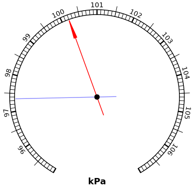

# SVG Barometer

Simple barometer gauge with a kPa scale, based on the design of the
[Lee Valley Tools barometer](https://www.leevalley.com/en-ca/shop/hardware/project-supplies/60020-weather-instruments).


## Example Image




## Example Usage

```python
import barometer

barometer.write_svg("barometer.svg", p_ref=97.35, p_ind=100.20)
```

Each needle is optional, so the following code will only draw the indicator needle.
```python
barometer.write_svg("barometer.svg", p_ind=100.20)
```


## Compatibility

Tested under Python 2.7.12 and Python 3.5.2.


## Script Font for Labels

The stylized script font used in the example image is [Anaktoria](https://fontlibrary.org/en/font/anaktoria-textfonts),
which will only render properly if you have Anaktoria installed on your system.

Rendered using Inkscape, it looks like [this PNG image](barometer.png).


## Acknowledgements

My python code adapts the javascript [derhuerst/svg-partial-circle](https://github.com/derhuerst/svg-partial-circle)
by @derhuerst to compute the arc of the pressure scale. Copyright :copyright: 2017, Jannis Redmann.
